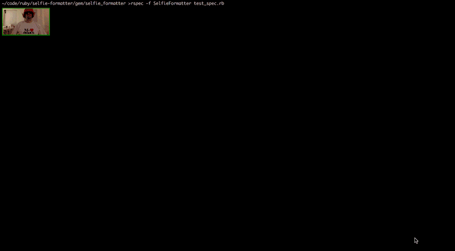

# The RSpec Selfie Formatter

An RSpec Formatter for the new generation of programmers.



Selfie Formatter takes photos of you while your tests run and uses them to track
progress and format the results.

Currently only works on OS X with iTerm2 >= 3.0. Also see [known issues](#known-issues).

## Installation

```
gem install selfie_formatter
```

Or, in your `Gemfile`

```ruby
gem "selfie_formatter", :group => "test"
```

## Usage

```
rspec -f SelfieFormatter
```

## Known Issues

Several...

## License

The gem is available as open source under the terms of the [MIT License](http://opensource.org/licenses/MIT).
